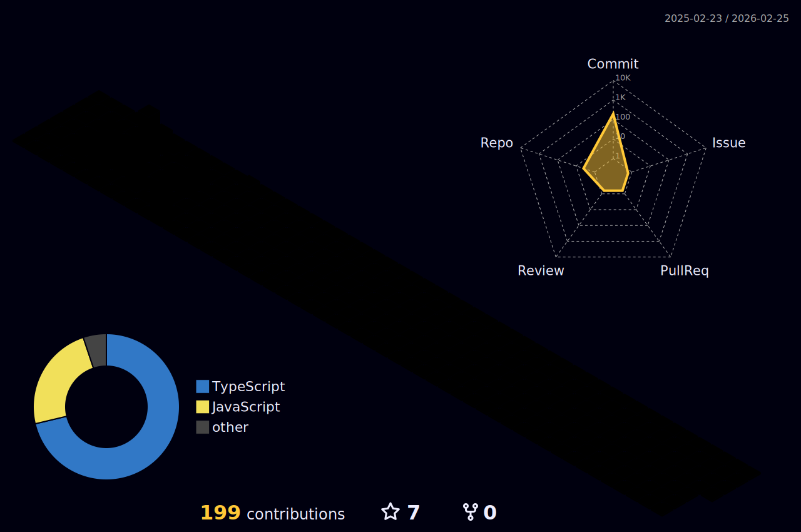

<h2><a href="https://emoji.gg/emoji/2653-kitty-paw"></a> Hi, I'm Ste! <a href="https://emoji.gg/emoji/7482-uwucat"></h2>

<p>
  <em>
    Associate Degree in Systems Analysis and Development, Universidade Cruzeiro do Sul<br>- completed in December 2024.
  </em>
</p><br>


[](https://www.linkedin.com/in/stephanni-cavalcante-759779186/)
[](https://github.com/stephannica)

### <a href="https://emoji.gg/emoji/7121-pinkkitty"></a> A little more about me...  
```javascript
const aboutMe = {
  pronouns: "she" | "her",
  age: 25,
  country: "Brazil",
  loves: ["cats 🐱", "series 🎥", "cute & colorful things 🌈", "drinking water 💧"],
  personality: "always learning",
};

const journey = {
  currentFocus: "Frontend Development 💻",
  goal: "Become a Fullstack Developer 🌟",
  learning: [TypeScript, React],
};

const skills = {
  frontend: [HTML5, CSS3, JavaScript, TypeScript, React],
  backend: [Node.js],
};

const connect = () => {
  console.log("✨ Let's build something amazing together!");
};

connect();
```


---
